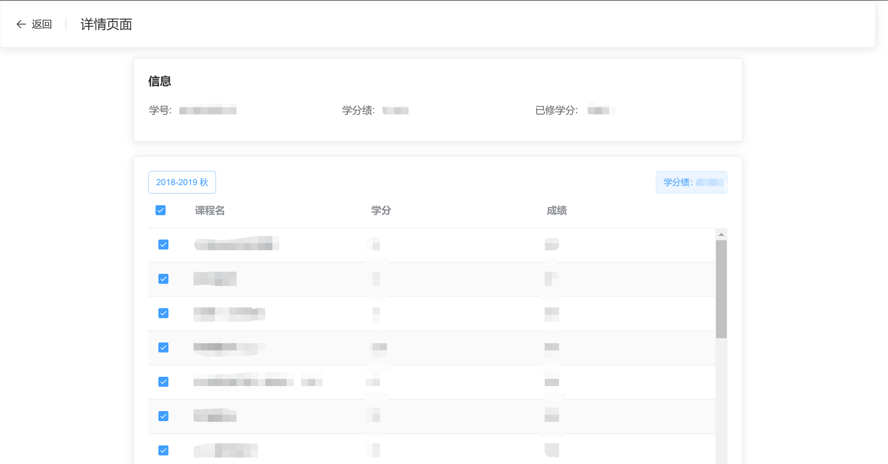
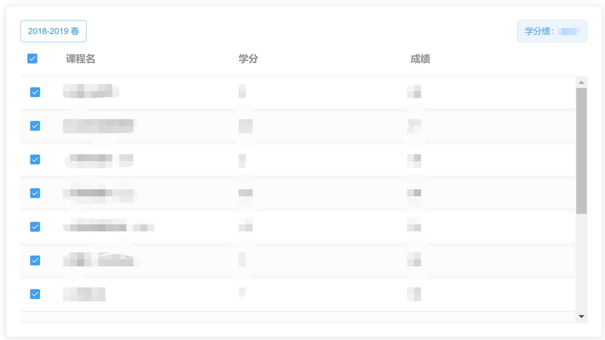

# NWPU_GPA

简单实现的一个网站用于核算学分绩。

前端采用Vue框架，后端由[checkscore](https://github.com/rycbar77/checkscore)修改过来所以使用flask简单实现。

## 界面

登录界面输入翱翔门户学号和密码进行查询


详情界面上方显示个人信息、总学分以及学分绩，下方显示成绩详情



成绩详情部分分学期显示成绩，左上角显示学期，右上角显示当前学期学分绩，课程可勾选/全选，选择参与或不参与学分绩计算，非百分制课程不计入。



## 运行

### 前端

```shell
npm install
npm run serve
```

### 后端

```shell
pip install -r requirements.txt
python app.py
```

## features

- 可分学期计算
- 可全选

## Known issues

- 无法自适应屏幕大小
- 不计算绩点
